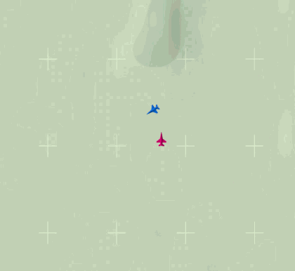
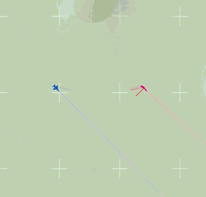
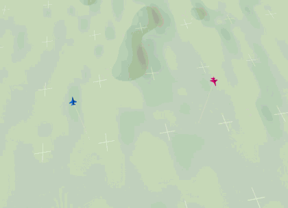

# aircombat-rl

Air combat environments on a JSBSim F-16.

## Setup


```bash
conda create -n aircombat python=3.10 # Python 3.10
conda activate aircombat

pip install -r requirements.txt      # dependencies
pip install -e .                     # the package itself
```

Check it:

```bash
python -m aircombat_gym.wvr.play --env circular      # fly one yourself
```

From Python:

```python
import gymnasium as gym
import aircombat_gym.wvr.envs          # registers the ids

env = gym.make("AirCombat/Circular-v0")
```

## Windows + Intel GPU (이 PC의 설정)

프로젝트 전용 Python은 `.venv\Scripts\python.exe`입니다. 기존 Anaconda의
Python·패키지와 분리되어 있으며, PowerShell에서 환경을 활성화하지 않고 아래처럼
실행할 수 있습니다. 명령은 저장소 루트에서 실행합니다.

확인한 구성: Windows 11, Intel Arc B390, 그래픽 드라이버 `32.0.101.8622`,
Python `3.12.13`, PyTorch `2.14.1+xpu`, Stable-Baselines3 `2.9.0`, JSBSim `1.3.0`.
PyTorch의 [공식 XPU 설치 경로](https://docs.pytorch.org/docs/stable/notes/get_start_xpu.html)를
사용합니다. 별도 CUDA 설치는 필요하지 않습니다.

### GPU 및 학습 호환성 확인

```powershell
.\.venv\Scripts\python.exe -m tools.check_xpu
```

Circular 기준 모델로 1,200스텝을 실행하여 실제 XPU 가중치 갱신, 유한한 수치,
모델 저장, XPU·CPU 재로딩을 확인합니다. 결과는
`runs/xpu_smoke/project_01_circular/report.json`에 저장됩니다.
이 검사는 승률 평가나 CPU/GPU 속도 비교가 아닙니다.
다른 과제는 `--project project_04_fair` 등의 옵션으로 선택합니다.

### 학습 실행

```powershell
.\.venv\Scripts\python.exe templates\project_01_circular\train.py --device xpu --steps 200000 --tag _xpu
```

네 과제의 `train.py` 모두 `--device cpu`, `--device cuda`, `--device xpu`를 받습니다.
지정하지 않으면 CPU를 사용합니다. 명시한 GPU가 사용 불가능하면 오류를 표시합니다.
기존 `--cuda` 옵션은 종전처럼 CUDA가 없을 때 CPU로 돌아가는 동작을 유지합니다.
`--cuda`와 `--device`는 동시에 지정할 수 없습니다.

JSBSim 시뮬레이션은 CPU에서, 신경망 연산은 XPU에서 수행합니다.
작은 정책망에서는 GPU 사용이 전체 학습 속도 향상을 보장하지 않습니다.
기존 학습기는 검증 간격 단위로 학습하므로, 짧은 환경 점검에는 `--steps`만 줄이는
대신 위의 `tools.check_xpu`를 사용합니다.

### 같은 환경을 새로 만들 때

현재 PC에는 이미 설치되어 있습니다. 아래 명령은 새 환경을 재현할 때 사용합니다.
`uv`가 설치되어 있다는 전제이며, `.venv`가 없는 새 체크아웃에서 실행합니다.

```powershell
uv venv .venv --python 3.12.13 --managed-python --seed
.\.venv\Scripts\python.exe -m pip install -r requirements-windows-xpu.lock.txt
.\.venv\Scripts\python.exe -m pip install --no-deps -e .
.\.venv\Scripts\python.exe -m tools.check_xpu
```

`requirements-windows-xpu.lock.txt`는 이 Windows/XPU 환경에 설치한 패키지 버전 목록입니다.
CUDA 서버에는 해당 파일을 그대로 사용하지 말고 서버에 맞는 PyTorch 빌드를 설치합니다.
모든 패키지는 프로젝트의 `.venv`에 설치하며, Anaconda 기본 환경에는 설치하지 않습니다.
VS Code에서도 인터프리터를 `.venv\Scripts\python.exe`로 선택합니다.

### CPU / Intel GPU 속도 측정 (2026-10-01)

이 노트북의 **Circular 기본 DQN에서는 CPU가 더 빨랐습니다.**
CPU 1스레드는 Intel GPU 기본 설정보다 약 **2.83배**, CPU 기본 16스레드보다
약 **1.50배** 높은 학습 처리량을 보였습니다.

| 설정 | 1만 스텝 학습 시간 중앙값 | 3회 측정 범위 | 중앙값 기준 처리량 |
|---|---:|---:|---:|
| CPU 기본 (PyTorch 16스레드) | 14.77초 | 13.96–21.61초 | 677 스텝/초 |
| CPU (PyTorch 1스레드) | 9.84초 | 9.10–14.81초 | 1,016 스텝/초 |
| Intel Arc B390 XPU (호스트 16스레드) | 27.88초 | 24.16–39.25초 | 359 스텝/초 |

조건은 기본 `[64, 64]` 신경망, batch 32, 실행당 10,000스텝과 2,250회 갱신입니다.
seed 0·1·2마다 새 프로세스에서 실행했고, 장치별 순서를 순환시켰습니다.
같은 seed의 초기 가중치와 갱신 횟수가 일치하는지도 검사했습니다.
준비용 모델을 1,024스텝 실행한 뒤 버리고 새 모델을 만들어 측정했으며,
XPU는 측정 시작·종료 시 동기화했습니다.

표의 시간은 **JSBSim 실행·정책 추론·경험 수집·신경망 갱신**을 포함합니다.
Python 패키지 import, 준비 실행, 모델 생성, 검증 에피소드, 모델 저장은 제외합니다.
별도 프로세스 전체 시간의 중앙값은 CPU 기본 19.84초, CPU 1스레드 15.04초,
XPU 36.54초였으며, 초기 준비를 포함해도 이번 측정의 순위는 같습니다.

전원 상태는 배터리 구동(측정 전 36%, 측정 후 34%), 전원 계획은 SAMSUNG MODE였습니다.
일반 앱이 실행 중인 상태에서 측정했으므로 범위에 변동이 있습니다.
이 결과는 현재 Circular 기준 모델의 속도 비교이며, 승률 비교나 더 큰 신경망·다른
알고리즘의 속도를 보장하지 않습니다. 훈련 코드의 기본 설정은 이 측정으로 바꾸지 않았습니다.

재실행:

```powershell
.\.venv\Scripts\python.exe -m tools.benchmark_devices --steps 10000 --repeats 3 --out runs\device_benchmark_repeat
```

원본 수치: [results.json](runs/device_benchmark/results.json),
장치·전원 상태: [machine.json](runs/device_benchmark/machine.json).
두 파일은 로컬 `runs/` 폴더에 있으며 Git에서는 제외됩니다.

## Plan A 실험 결과

FairFight에서 원본 DQN 재현과 관측 개선·DQN/PPO 비교를 실행했습니다.
세 비교 조건을 각각 204,800스텝씩 seed 3개로 학습했습니다.
개선 관측 DQN의 선택 모델은 별도 시험에서 **7/40(17.5%)**였지만,
나머지 두 반복은 0/40이어서 안정적인 성능으로 보기는 어렵습니다.
기본 관측 DQN과 개선 관측 PPO는 세 반복 모두 0/40이었습니다.

조건·해석·실행 명령은 [Plan A 실험 기록](experiments/plan_a/README.md)에 정리했습니다.
선택 모델은 `runs/plan_a_20261001/comparison/selected_policy/`에 있습니다.

추가로 개선 관측 DQN을 같은 시드 3개에서 1,024,000스텝까지 학습했습니다.
같은 새 시험 조건에서 검증 선택 모델의 평균 승률은 20만 스텝 예산의 8.33%에서
100만 스텝 예산의 21.67%로 올랐습니다. 다만 100만 스텝 마지막 모델들은 모두 0/40이어서,
중간 모델을 검증으로 선택하는 과정이 필요했습니다.
[추가 학습 기록과 그래프](experiments/plan_a/duration.md)에 결과와 한계를 정리했습니다.

## Environments

| | |
|---|---|
| <b><code>AirCombat/Circular-v0</code></b><br>An unarmed target holding a steady turn.  It never reacts to you.<br><a href="templates/project_01_circular">templates/project_01_circular</a> |  |
| <b><code>AirCombat/Evader-v0</code></b><br>An unarmed target that turns away when you close.<br><a href="templates/project_02_evader">templates/project_02_evader</a> |  |
| <b><code>AirCombat/AdvantagedFight-v0</code></b><br>Both aircraft armed.  You start roughly pointing at the opponent; it starts pointing anywhere.<br><a href="templates/project_03_advantaged">templates/project_03_advantaged</a> |  |
| <b><code>AirCombat/FairFight-v0</code></b><br>Both aircraft armed, well apart and pointing straight at each other.<br><a href="templates/project_04_fair">templates/project_04_fair</a> |  |

## What is in here

```
aircombat_gym/   the environments.  The only thing that gets installed
templates/       one folder per environment: what to hand in, and how to score it
tools/           grade and watch, shared by all of them
```

