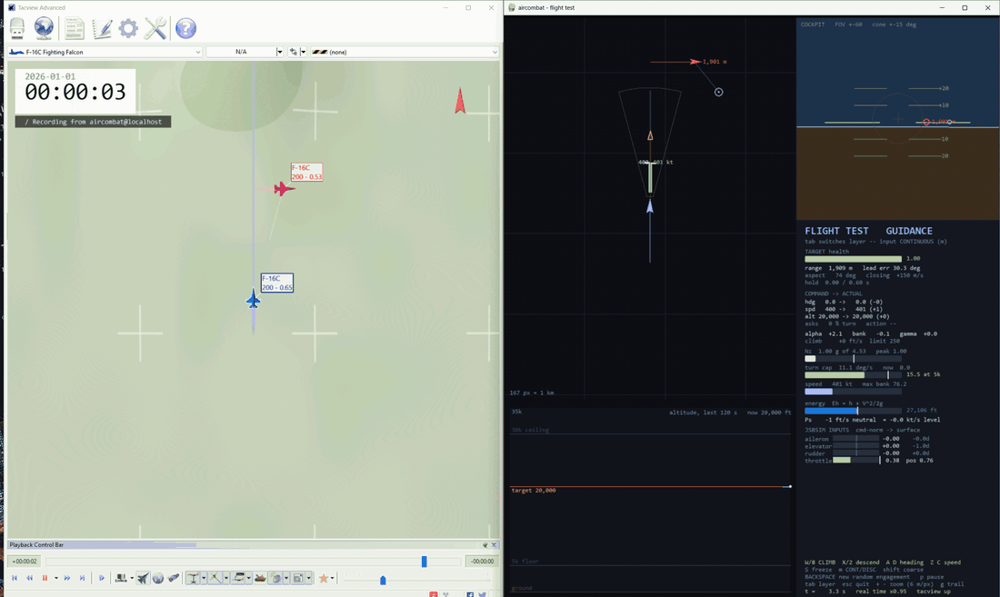

# aircombat_gym

An F-16 air combat environment on [JSBSim](https://github.com/JSBSim-Team/jsbsim)'s
6-DOF model — the real flight control system, not a point mass.


## Install

```bash
pip install -e .
```


## Feel the aircraft

```bash
python -m aircombat_gym.tools.manual_operation --tacview                   # solo
python -m aircombat_gym.tools.manual_operation --tacview --enemy circler   # with a target
```



> **On macOS or Ubuntu, drop `--tacview`** from anything below — TacView is Windows-only. Everything you need is in the pygame panel; you only lose the 3D view. `--acmi flight.acmi` records a file on any OS and opens on Windows later.


## Two control modes

| | **AUTOPILOT** (default) | **STICK** |
|---|---|---|
| you command | target heading, speed, altitude | aileron, elevator, rudder, throttle |
| who flies | the controller works out bank, g, thrust | you |
| why | **this is the interface your policy uses** | to see what happens underneath |


## Keys

Letters mirror the numpad 3×3, so it works one-handed and works on a laptop.

```
   Q W E          7 8 9          rudder / pitch / rudder
   A S D    ==    4 5 6          left / centre / right
   Z X C          1 2 3          throttle+ / pitch / throttle-
```

| axis | keys | **AUTOPILOT** | **STICK** |
|---|---|---|---|
| left/right | `A` `D` | target heading ∓ | roll left / right |
| up | `W` | **climb** | **nose down** (stick forward) |
| down | `X` | descend | nose up |
| fore/aft | `Z` `C` | target speed ± | throttle up / down |
| rudder | `Q` `E` | — | rudder left / right |
| centre | `S` / space | freeze all three targets | centre the stick |
| `shift` | | bigger step | full deflection |

Arrow keys, `Home`/`PgUp`/`End`/`PgDn`/`Ins`/`Del` and the numpad all work too,
NumLock on or off.

Also: `tab` layer · `m` CONTINUOUS↔DISCRETE (AUTOPILOT only) · `p` pause ·
`r` reset · `esc` quit · `+` `−` zoom · `g` trail length


## Available `Gym` environments

| id | the other aircraft | how it starts | timeout |
|---|---|---|---|
| `AirCombat/Circular-v0` | orbits at a fixed rate. Never evades, never aims | you 1.5–4 km out, nose within 90° of it | 120 s |
| `AirCombat/Evader-v0` | cruises straight, then breaks hard in a random direction when you close | same | 240 s |
| `AirCombat/AdvantagedFight-v0` | lead pursuit with closure control — the strongest one here | 4–10 km apart, your nose within 90° of him and his free, so the opening is usually yours | 120 s |
| `AirCombat/FairFight-v0` | the same one | abeam, 10 km, opposite headings — dead even | 120 s |
Whichever you pick:

- **observation space** — the same 39 raw channels every time
- **action space** — two axes, heading and speed. `Discrete(9)` by default,
  three values each; `Box(2)` in [-1, 1] with `action_mode="continuous"`
- **both aircraft held at 20,000 ft** — the third axis is closed, so nothing you
  send can move it, and the autopilot's altitude hold flies it for you

### How to Use
```python
import gymnasium as gym
import aircombat_gym.wvr.envs                 # registers the ids

env = gym.make("AirCombat/Circular-v0")       # obs 39, action Discrete(9)
obs, info = env.reset(seed=0)
obs, reward, terminated, truncated, info = env.step(action)
```

**The environment does not compute a reward** — `step` returns 0.0 and hands the
material out in `info`. Writing the reward, and turning the 39 raw channels into
something a network can learn from, is yours.

## Be the policy

```bash
python -m aircombat_gym.wvr.play --env fair --tacview
```

Four arrow keys, and each press becomes an element of `env.action_space` and
goes through `env.step()` — same weapon, same opponent, same `info`, no shortcut
around the environment. **Fly a task before you write a reward for it**, or the
reward is a guess about a game you have not played.

| | |
|---|---|
| `←` `→` | heading −30° / +30° |
| `↑` `↓` | speed +20 kt / −20 kt |
| nothing held | the no-op action, which *freezes* the target rather than re-deriving it |
| `m` | swap `Discrete(9)` for `Box(2)` mid-engagement — the same fight, the other action space |
| `r` new engagement · `p` pause · `+` `−` zoom · `g` trail · `esc` quit |

`--env` takes `circular`, `evader`, `advantaged` or `fair`. 
