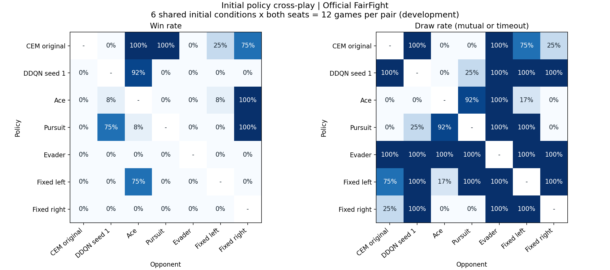

# 정책 간 대결과 자동 반복 학습

목표는 Ace 전용 공략의 승률이 아니라 여러 정책을 상대하는 대회 성능이다.
기존 `experiments/plan_a/cem_policy`는 보존한다. 현재 학습 방식은 신경망이 아닌,
공개 관측으로 반응하는 17개 제어 파라미터의 CEM 탐색이다.

**첫 리그 묶음의 최종 평가 완료:** 동일16상대·각1,280경기에서 사전 선택 정책77.6%, 기존26.6%, 직접 대결80전 전승.
[상대별 결과·한계](result.md), [새 세션 시작 안내](../../../START_HERE.md), [현재 상태](../../../docs/LEAGUE_STATE.json)를 따른다.
아래 절차는 실행한 프로토콜이며, 완료한 실행을 새로 시작하라는 뜻은 아니다.

## 반복 절차

1. 기존 CEM, DDQN, Ace, Pursuit, Evader, 좌/우 고정 선회 정책으로 시작한다.
2. 상대별 약점을 반영하면서 모든 상대에 학습 가중치를 남겨 새 후보를 학습한다.
3. 새로운 초기조건에서 후보와 현재 챔피언을 같은 상대들에게 대결시킨다.
4. 평균 성적, 승률, 약한 상대들에 대한 성적, 챔피언과의 직접 대결로 교체를 결정한다.
5. 교체되지 않은 후보도 과거 상대 목록에 보존한다. 같은 정책의 중복은 학습 가중치를 늘리지 않는다.
6. 다음 후보를 학습한다. 두 번 연속 교체 실패하면 탐색 범위를 늘린다.

6라운드가 한 개발 묶음이다. 묶음 종료는 목표 완료를 뜻하지 않는다.
결과를 분석한 뒤 독립 반복과 분리 평가로 진행하거나, 실패 원인을 반영한 다음 묶음을 진행한다.
단순히 마지막 모델을 채택하지 않으며, 학습 시간이 늘었다고 개선을 가정하지 않는다.

## 공정성과 평가 범위

- 공식 FairFight의 초기조건, JSBSim 물리, 20Hz, 무장, 9행동, 승패 판정은 그대로다.
- 양측은 같은 시점의 자기 관점 관측을 사용하고, 같은 초기 seed를 양 진영에서 평가한다.
- 승/패/동시격추/시간초과를 모두 저장한다. 개발용 경기 점수는 승 1, 무승부 0.5, 패 0이다.
  실제 대회에서 무승부를 어떻게 집계하는지는 이 실험이 확정하지 않는다.
- 훈련 목적함수는 가중 승률 65%, 가중 경기점수 20%, 하위 25% 상대 경기점수 15%다.
  아무도 공격하지 않는 무승부만으로 학습 성공을 선언하지 않는다.
- 훈련과 개발 평가에 넣지 않은 상대는 Lead, Circler, DDQN seed 0이다.
  이들은 다른 학생들의 실제 제출물을 대신하지 못한다.
- 훈련: 100000000번대, 개발: 30001000번대, 라운드 교체 평가: 31000000번대.
  최종 시험 40000000번대는 별도로 예약하며, 개발 결과가 나오기 전에는 열지 않는다.
- 가능한 모든 연속 상태를 경험할 수는 없다. 우선 공식 시작 조건에서 상대 행동을 다양화한다.
  초기 구도 확대는 별도 훈련/스트레스 평가로 다루고 공식 결과와 섞지 않는다.

## 실행과 기록

프로젝트 루트 `aircombat-rl`에서 기존 Python 환경을 사용한다.

```powershell
python -m tools.league_matches --out runs/league_20261006/baseline --n 12
python -m tools.league_train --out runs/league_20261006/main --rounds 6
```

대결표의 기존 경로는 다시 만들 수 없다. 학습은 같은 명령으로 완료된 경기부터 재개할 수 있으며,
설정·입력·소스가 바뀌면 기존 실험에 이어 쓰지 않고 실패한다. 새 설정은 새 출력 경로를 사용한다.
라운드별 `round.json`, 상대별 경기 기록, 탐색 분포/RNG, 모든 세대 체크포인트를 보존한다.
학습 중에는 최상위 `progress.json`과 각 라운드 `search/progress.json`을 확인한다.

초기 개발 대결 252경기에서 CEM은 Ace/Pursuit에 각각 12승, DDQN/Evader에 각각 12무승부였다.
이 결과는 대회에서 모든 정책을 이긴다는 근거가 아니다.



## 이번 묶음의 실행 경과

본 학습 `runs/league_20261006/main`은 6라운드로 시작했다.
6라운드를 완료했고 챔피언은 3번 교체됐다. 전체 후보 재선발로 선택한 부모는 `round_05`다.
새 개발 조건에서 동일 13상대·520경기를 비교하면 새 부모 승률75.58%, 원래 CEM24.62%, 직접 대결40전 전승이었다.
이 수치는 개발 단계 결과이며 최종 시험 결과는 후속 완료 기록을 따른다.
`tools.league_validate --all-candidates`가 실제 본 학습 프로세스를 감시하며 완료 후 새 개발 조건에서 다시 비교한다.
현재 후속 출력은 `runs/league_20261006/followup_pool`이다. 이전 `followup` 대기 작업은 평가를 시작하기 전에 종료하고 기록을 보존했다.
라운드 중의 직전 챔피언 대결 조건은 그대로 보존하되, 후속 선발에서는 모든 라운드 후보를 같은 전체 상대 목록에 대결시킨다.
상위 2후보를 새로운 개발 조건에서 재확인해 부모 모델을 고른다. 최종 시험에도 초기 7정책뿐 아니라 모든 보존된 라운드 후보를 포함한다.
관문을 통과하면 난수 seed 2200/2201/2202의 독립 미세조정과 분리 시험을 자동 실행한다.
이 세 반복은 하나의 학습 부모와 상대 목록을 공유하며, 독립적인 최초 발견 3회가 아니다.
관문에 실패하면 시험을 열지 않고 `analysis_required`로 기록한다. 이 상태는 전체 목표의 완료가 아니다.

초기 후보 [counter_v1](counter_v1/README.md)은 기존 CEM에게 17승 3패였지만,
Ace와 Pursuit에는 각각 20전 전패여서 챔피언으로 교체하지 않았다. 다음 모델의 훈련 상대에는 추가했다.

본 학습 후속 단계의 기본 명령은 아래와 같다. `--pid`에는 현재 살아 있는 본 학습 실행기 PID를 전달한다.

```powershell
python -m tools.league_validate --main runs/league_20261006/main --out runs/league_20261006/followup_pool --pid <PID> --all-candidates
python tools/league_report.py --plot
```

첫 명령은 이미 실행 중인 경우 중복 실행하지 않는다. 마지막 명령은 읽기 전용 요약/그래프 갱신이다.

네 번째 후보는 교체 평가에서 10상대 평균 승률77% 대 당시 챔피언57.5%였고,
기존 CEM/Ace/Pursuit에 각각20전전승이었다. 그러나 직전 챔피언에게2승13무5패여서 라운드 교체에서 탈락했다.
이 관찰을 근거로 전체 후보를 동일 상대 목록에서 재선발하는 후속 절차를 추가했다. 최종 시험 결과를 보고 규칙을 바꾼 것이 아니다.

`adaptive.py`는 초기 상대 움직임을 보고 두 고정 정책 중 하나를 선택하는 예비 모듈이다.
단독 로더·시계 기반 초기화·상태 선택 테스트만 완료했고, 아직 이 방식으로 학습하거나 성능을 주장하지 않는다.
