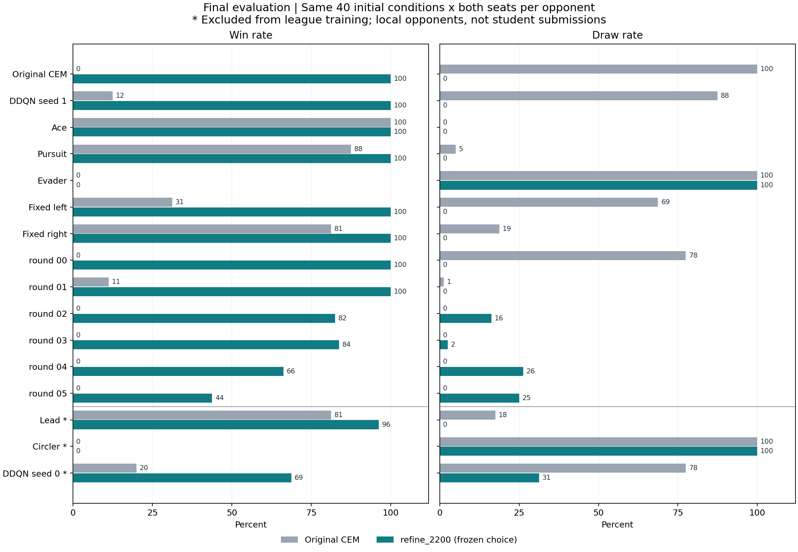

> **2026-10-09 정정:** 아래 수치·표·그림·평가 관문은 당시 구판정 기록이다. 동일 경기의 종료 체력4자리 반올림 재판정은 기존35.8%(458승305무517패) → 사전 선택 정책85.8%(1,098승126무56패), 직접 대결80전 전승이다. 추가 학습이나 새 시험 결과가 아니다. [최신 재판정과 재현 자료](../../../docs/first_league_health_rejudge_20261009/README.md).

# 다양한 정책을 상대하는 자동 학습 결과 — 구판정 기록

최종 시험 전에 개발 기준으로 고른 정책은 **refine_2200**다. 같은 16상대·각 1,280경기에서 기존 CEM 승률 **26.6% → 새 정책 77.6%** (+51.0%p)였다.
원시 결과는 기존 340승 523무 417패, 새 정책 993승 241무 46패다. 사전 평가 관문은 **evaluation_passed**다.

## 실제로 실행한 자동 반복

6차례 후보 학습→기존 전체 상대와 대결→후보 보존을 실행했고 챔피언은 3번 교체됐다. 교체되지 못한 후보도 다음 학습 상대에 추가했다. 이후 모든 후보를 동일 13상대로 재선발해 round_05를 부모로 고르고, 난수 seed 2200/2201/2202로 각각 추가 학습했다. 최종 정책은 시험을 열기 전에 고정했다.

현재 방식은 공개 관측에 반응하는 **17개 제어 계수를 CEM으로 탐색하는 학습**이다. DQN/PPO 신경망의 수렴을 달성한 결과는 아니다. 원래 정책과 6개 후보, 3개 미세조정 정책을 모두 보존했다.

## 같은 최종 조건에서의 비교

| 정책 | 전체 승률 | 보관 상대 13종 | 학습 제외 상대 3종 | 전체 승/무/패 |
|---|---:|---:|---:|---|
| cem_original | 26.6% | 24.9% | 33.8% | 340승 523무 417패 |
| refine_2200 **(사전 선택)** | 77.6% | 82.8% | 55.0% | 993승 241무 46패 |
| refine_2201 | 81.8% | 81.9% | 81.2% | 1047승 179무 54패 |
| refine_2202 | 77.5% | 76.3% | 82.5% | 992승 222무 66패 |

추가 학습 3회의 평균 승률 개선은 +52.4%p, 초기조건 단위 bootstrap 95% 구간은 [+50.3, +54.5]%p다. 이는 선택 정책 하나의 신뢰구간이 아니라 3개 정책의 평균 개선에 대한 구간이다.

모든 상대에 공통인 40개 초기조건×양 좌석=상대당 80경기다. 총 경기 수만큼 독립 표본이 있는 것은 아니다. 구간은 고정된 정책·상대 집합에 조건부이며 독립적인 최초 학습의 변동성을 나타내지 않는다. 세 추가 학습은 같은 부모와 상대 집합을 공유한다.

### 사전 선택 정책의 상대별 결과

| 상대 | 기존 CEM 승/무/패 | 새 정책 승/무/패 | 새 정책 승률 |
|---|---|---|---:|
| cem_original | 0승 80무 0패 | 80승 0무 0패 | 100.0% |
| ddqn_s1 | 10승 70무 0패 | 80승 0무 0패 | 100.0% |
| ace | 80승 0무 0패 | 80승 0무 0패 | 100.0% |
| pursuit | 70승 4무 6패 | 80승 0무 0패 | 100.0% |
| evader | 0승 80무 0패 | 0승 80무 0패 | 0.0% |
| fixed_left | 25승 55무 0패 | 80승 0무 0패 | 100.0% |
| fixed_right | 65승 15무 0패 | 80승 0무 0패 | 100.0% |
| round_00 | 0승 62무 18패 | 80승 0무 0패 | 100.0% |
| round_01 | 9승 1무 70패 | 80승 0무 0패 | 100.0% |
| round_02 | 0승 0무 80패 | 66승 13무 1패 | 82.5% |
| round_03 | 0승 0무 80패 | 67승 2무 11패 | 83.8% |
| round_04 | 0승 0무 80패 | 53승 21무 6패 | 66.2% |
| round_05 | 0승 0무 80패 | 35승 20무 25패 | 43.8% |
| lead (학습 제외) | 65승 14무 1패 | 77승 0무 3패 | 96.2% |
| circler (학습 제외) | 0승 80무 0패 | 0승 80무 0패 | 0.0% |
| ddqn_s0 (학습 제외) | 16승 62무 2패 | 55승 25무 0패 | 68.8% |



### 추가 학습 정책끼리의 대결

| 정책 A | 정책 B | A 관점 승/무/패 |
|---|---|---|
| refine_2200 | refine_2201 | 38승 21무 21패 |
| refine_2200 | refine_2202 | 35승 20무 25패 |
| refine_2201 | refine_2202 | 26승 30무 24패 |

이 대결은 최종 정책을 고른 뒤의 진단이다. 시험에서 더 좋아 보이는 모델로 선택을 바꾸지 않았다.

## 도주형 상대 진단

선택 정책은 Evader에 0승 12무 0패, 8개 수동 추격 설정 중 선택된 `pursuit_650_lead6`는 1승 11무 0패였다. 별도의 공개 개발 조건 6개×양 좌석에서 확인한 진단이며, 이 8개는 새로 학습한 모델이 아니다.
평균 최소 거리는 선택 정책 7,523m, 진단에서 선택된 설정 2,965m였다. 이 유한한 실험으로 격추 가능/불가능을 일반적으로 증명할 수는 없다.

선택된 수동 추격 설정을 새로운 개발 조건40개×양 좌석에서 재확인했다. 기존 정책은 0승 80무 0패, 추격 설정은 10승 70무 0패였다. 초기조건 단위 승률 차이95% 구간은 [+3.8, +21.2]%p다.
이는 도주형 상대에 대한 개선 가능성을 확인한 결과다. 다른 상대에 대한 성능을 확인한 새 학습 정책이 아니므로 기존 최종 모델을 교체하지 않았다. 다음 작업은 관측에 따라 추격을 선택하는 정책을 전체 상대 집합에서 학습·비교하는 것이다.

## 해석과 다음 사용

- 공식 FairFight 초기조건·JSBSim 물리·20Hz·무장·9행동·승패 판정을 유지했다. 대결 상대를 바꿔 평가했다.
- 무승부 0.5는 개발 목적함수의 규칙이다. 공식 대회의 무승부 배점이라고 가정하지 않았다. 최악 상대 점수 0.5는 최악 승률 50%를 뜻하지 않는다.
- Lead·Circler·DDQN seed 0은 이번 리그 학습에서 제외한 로컬 상대다. 실제 다른 학생 모델을 이겼다는 증거는 아직 없다.
- 연속 상태의 모든 상황을 경험할 수는 없다. 이번 검증은 공식 시작 조건과 고정된 상대 집합에 한정된다.
- 다음 확장은 실제 참가자 정책을 보관 상대에 추가하고, 약점 상대를 반영해 다음 모델을 학습하는 것이다. 예전 정책들도 계속 유지해 특정 상대만 이기는 전략으로 퇴행하는지 확인한다.
- 시험 band 40000000은 이제 사용했다. 이 결과를 바탕으로 후속 학습하면 새 미래 시험 band를 따로 잡아야 한다.

## 실행 파일과 재현

최종 정책: `experiments/league/bundle/models/final/`. 원래 정책: `bundle/models/cem_original/`. 묶음의 `manifest.json`에서 파일 해시와 평가 상태를 확인한다. [묶음 안내](bundle/README.md)에 실행 방법이 있다.

```powershell
python -m tools.league_duel --a experiments/league/bundle/models/final --b path/to/other_policy --out runs/next_opponent --band 33020000 --n 40
```

원시 평가·설정·선택 기록은 `runs/league_20261006/followup_pool/`, 이동용 근거는 `bundle/evidence/final/`에 보존한다. GitHub 보관 범위와 다음 작업은 저장소 루트의 `START_HERE.md`, `docs/LEAGUE_STATE.json`을 따른다.
