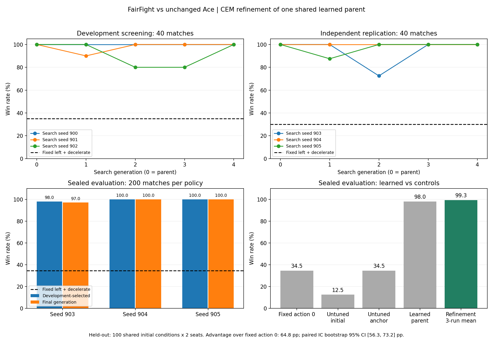
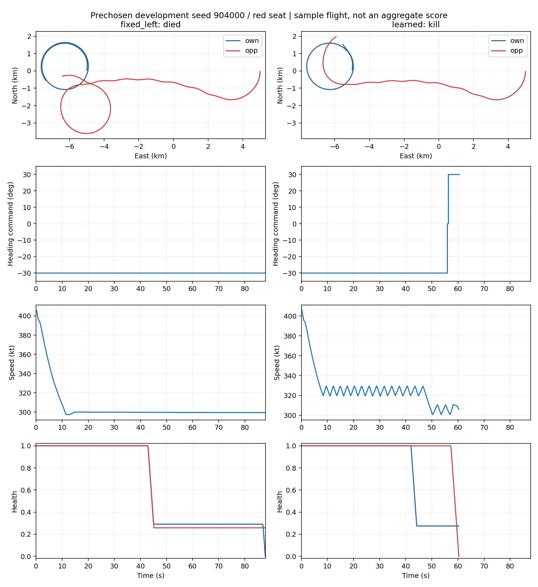

# 자동 반복 실험 완료 — 2026-10-06

**FairFight의 현재 Ace 상대에서 사용할 정책을 확보했다. 미리 선택한 최종 정책은 새 시험200경기에서200승, 고정 좌선회·감속은69승이었다.**

효과를 확인한 방법은 CEM으로7개 제어 파라미터를 경기 결과에 맞춰 탐색하고, 검증된 부모를 보존하며 미세조정하는 방식이다.
신경망 DQN/PPO와는 다른 정책 표현이다. 공개39관측과 원본9행동을 사용하며 JSBSim 물리·상대·무장·20Hz 결정 주기·공식 승패 판정은 바꾸지 않았다.

## 최종 시험

시험band2000000의 **100개 초기조건×빨강/파랑 좌석=정책당200경기**다.
훈련·개발 검증과 분리했고, 개발 관문을 통과한 후 정책과 선택 규칙을 고정하여 한 번 열었다.

| 정책 | 승리/경기 | 승률 |
|---|---:|---:|
| **배포 정책: 미세조정904, 마지막 세대** | **200/200** | **100%** |
| 미세조정903의 개발 선택 모델 |196/200|98%|
| 미세조정905의 개발 선택 모델 |200/200|100%|
| 처음 발견한 학습 부모800 |196/200|98%|
| 고정 좌선회·감속(action0) |69/200|34.5%|
| 학습 전 기본 제어 파라미터 |25/200|12.5%|
| 학습 전 장시간 좌선회 제어 파라미터 |69/200|34.5%|

세 미세조정의 개발 선택 모델 평균은99.3%, 마지막 모델 평균은99.0%였다.
마지막 모델의 개별 성적은194/200,200/200,200/200으로, 최고 평균의99.7%를 유지했다.
고정 기준 대비 평균 차이는 **+64.8%p**, 초기조건 단위로 양 좌석과 학습 반복을 묶은 paired bootstrap95%구간은 **+56.3~+73.2%p**다.
이 구간은 현재 세 미세조정 결과를 고정했을 때의 초기조건 변동을 나타내며, 모든 학습 실행의 불확실성을 포함하지 않는다.

각 정책은 같은100개 초기조건에서 평가했다. 세 번의200경기를 서로 독립인600개 초기조건으로 세면 안 된다.
903/904/905는 같은 학습 부모를 공유한 독립 미세조정이다. 별도로900/901/902의 사전 미세조정도 실행했지만, 독립적인 최초 학습6회가 모두 성공한 결과로 표현하지 않는다.

배포 모델은 **개발 검증 승리 수→체력차→작은seed** 순으로 선택했다.
개발906000에서 모두40승이었고,904의 평균 남은 체력이 가장 높아 선택되었다. 최종 시험 승률로 고른 것이 아니다.



## 무엇이 효과가 있었나

같은 개발906000의40경기에서, 최종 정책을 고정한 뒤 일부 동작만 바꿔 확인했다.
이 진단 결과로 배포 모델을 다시 선택하거나 시험에 맞춰 튜닝하지 않았다.

| 동작 변경 | 승리/40경기 |
|---|---:|
| 완성 정책 |40|
| 추적으로 전환하지 않고 같은 초기 목표 속도로 계속 좌선회 |10|
| 기동과 추적은 유지하되 두 단계 목표 속도를 모두300kt로 설정 |29|
| 초기 좌선회 없이 처음부터 추적 |0|

현재 조건에서는 **초기 기동→추적 전환과 속도 조절의 조합**이 중요했다.
단순 선회 하나를 계속 반복하는 정책과 구분된다. 이 진단만으로7개 파라미터 각각의 독립적인 효과나 다른 교전 조건의 우열까지 확정하지는 않는다.

미리 정한 개발seed904000의 비행 비교에서도 고정 정책은 양 좌석 모두 패배, 배포 정책은 양 좌석 모두 승리했다.
아래 그림은 개별 사례이고 평균 성능은 위 표를 기준으로 읽어야 한다.



## 자동 반복 과정에서 확인한 점

좋은 DDQN 행동을 복사한 PPO는 최종 평균26.7%로 고정 기준35%보다 낮아 확대하지 않았다.
처음부터 하는 CEM 탐색은 첫 묶음에서95%를 냈지만 새3회 재현은56.7%로 관문을 통과하지 못했다.
최종 시험을 열지 않고 교차 확인한 결과, 최초800/801 정책 자체는 다른 개발 조건에서도38/37승/40경기로 강했다.

그래서 검증된800을 매 후보 집합에 남기고, 후보를 평가하는 훈련 경기를6→12경기로 늘려 주변 파라미터를 탐색했다.
두 묶음의 미세조정에서 마지막 개발 성능이 모두40/40으로 유지된 뒤 최종 시험을 열었다.
자동 재현 경로 전달 오류1건은 학습 시작 전에 발견해 수정했고, 회귀 테스트와 실제 짧은 실행을 거쳐 재시작했다. 기존 결과는 보존했다.

큰 성능 향상은 최초 CEM 탐색으로 부모를 찾는 단계에서 나왔다.
부모196승에서 배포 정책200승으로의 차이는4경기이며, 이 작은 차이가 확실한 일반화 개선이라는 결론까지 내리지는 않는다.
또한 중간 세대에는 성능 하락도 있었다. 학습을 오래 하면 매번 좋아진다고 해석하면 안 된다.
기존 DQN/PPO와 정책 구조·학습량이 달라, CEM 알고리즘 하나의 효과만 분리한 비교도 아니다.

## 정책 파일과 실행

완성 정책은 [cem_policy](cem_policy/README.md)에 있다.

- `policy.py`, `wrappers.py`, `policy_net.zip`: 공식 실행 도구에서 바로 불러오는 정책.
- `policy_net.json`: 사람이 읽을 수 있는7개 학습 파라미터.
- `selection.json`, `score.json`, `evaluation/`: 선택 근거, 시험 경기 기록, 비교 결과.
- `learned_parent/policy_net.json`: 원래 학습 부모의 파라미터 백업.
- `docs/`: 학습 곡선과 양 좌석 비행 비교 그림.

`aircombat-rl` 폴더에서 기존 Python 환경으로 실행한다:

```powershell
python -m tools.watch templates/project_04_fair --design experiments/plan_a/cem_policy --seed 904000
```

CPU에서 학습·평가했으며 이 정책 실행에CUDA나 신경망 추론은 필요하지 않다.
이 노트북의 기존 환경을 직접 지정하려면 위의 `python` 대신 `& '..\..\aircombat-rl\.venv\Scripts\python.exe'`를 사용한다.

검증은 자동 진행/정책 관련6개 테스트, 기존 공통 학습·행동 관련11개 테스트,
실제 환경 smoke, 실제 관측253개의 저장 전후 행동 일치, 공식 grader의 양 좌석 경기 기록 일치까지 완료했다.
그래프는 실제 렌더링해 확인했다.

## 적용 범위와 종료 판단

사전에 정한 성공 기준(시험 평균60% 이상, 고정 기준보다15%p 이상,3회 중2회 이상 개선, 최종 성능80% 이상 유지, paired 구간 하한>0)을 충족했다.
따라서 좋은 방법 확인까지 반복하라는 목표의 종료 조건에 도달했으며, 추가 학습은 예약하지 않았다.

현재 결과의 범위는 **FairFight의 좁은 초기조건 분포와 고정 Ace 상대**다.
다른 초기 배치, 다른 상대, 자기 대전, 신경망으로의 이식은 아직 검증하지 않았다.
현재 시험band2000000은 이미 사용했으므로 이후 방법을 튜닝할 때 새 미사용 시험을 별도로 정해야 한다.

원시 기록은 `runs/autolab_20261005/`, 단계별 판단은 [autolab.md](autolab.md), 자동화 소스는 `tools/autolab_*.py`에 남겼다.
이후 다중 상대 리그로 확장한 내용과 GitHub 보관 범위는 [2026-10-06 업데이트](../../../docs/PROGRESS_20261006.md)를 따른다.
