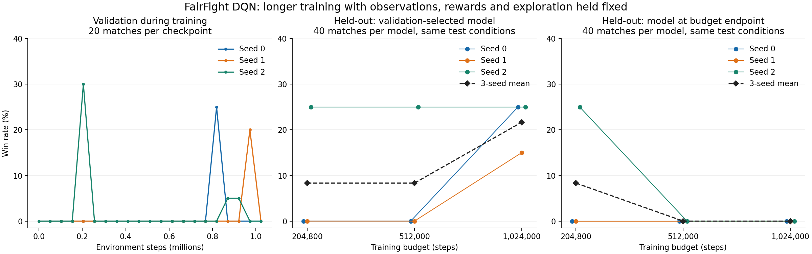

# 계획 A 후속: DQN 학습량 비교

실행일: 2026-10-01. 결과를 열기 전에 고정한 실험 계획이다.

## 질문과 통제 조건

개선 관측 DQN에서 학습량 증가가 승률과 시드 간 일관성을 개선하는지 확인한다.
FairFight, 31개 관측, 이산 행동 9개, 종료 보상 +1/-0.2, gamma 0.999,
기존 네트워크·최적화·재생 버퍼·종료 처리·학습 좌석을 유지한다.
물리, 상대, 자동조종기와 공식 평가 규칙은 그대로다.

이전 체크포인트에는 재생 버퍼가 없어 정확한 연속 학습을 할 수 없다.
seed 0·1·2에서 새로 시작해 각각 한 번의 `learn()` 호출로 1,024,000스텝을 학습한다.
204,800 / 512,000 / 1,024,000스텝에서 비교한다. 같은 시드의 세 예산은
하나의 학습 경로를 공유하므로 서로 독립 실행으로 세지 않는다.

epsilon은 **첫 20,480스텝에서 1.0 → 0.05**로 감소하고 이후 0.05를 유지한다.
전체 예산의 10%를 그대로 사용하면 탐험 기간도 5배 길어지므로,
이번 1,024,000스텝 실행에서는 비율을 0.02로 설정한다. 학습률은 기존 상수다.
원래 204,800스텝 실행과 이번 경로의 같은 시점에서 가중치 및 검증 경기 결과를 비교해
앞부분의 재현 여부를 기록한다.

CPU 1스레드인 독립 프로세스 3개를 동시에 사용한다.
앞선 이 노트북의 작은 DQN 벤치마크에서 Intel XPU보다 빨랐던 설정이다.

## 검증과 시험

- 기존과 같은 51,200스텝 간격, 검증 20경기, band 900000, 양쪽 좌석을 사용한다.
- 각 예산 이내에서 검증 승리 수 → 평균 승리 시간 → 더 이른 체크포인트 순서로 선택한다.
- 예산이 늘면 선택 후보 수도 많아진다. 이를 구분하기 위해 **각 예산의 마지막 가중치**도 함께 평가한다.
- 모든 학습과 선택을 마친 후 새 시험 band **1200000**, 40경기(좌석별 20)를 연다.
- 기존 시험 band 1100000은 새 시험으로 재사용하지 않는다.
- 시드별 승리 수, 3회 평균과 표본 표준편차, 실제 선택 시점, 학습 중 승리 수를 기록한다.
- 대표 모델은 100만 스텝 예산 내의 검증 결과로만 결정한다. 최종 시험 성적으로 다시 고르지 않는다.
- 시드 3개와 경기 40개는 초기 판단용이며, 일반적인 우월성이나 안정성을 확정하지 않는다.

## 저장과 재개 범위

모든 검증 시점의 가중치를 저장한다. 세 비교 시점에는 추가로 재생 버퍼와
Python/NumPy/PyTorch RNG 상태를 저장한다. 모델 ZIP에는 optimizer도 들어 있다.
JSBSim의 비행 중 상태까지 저장하지 않으므로, 향후 재개는 새 에피소드에서 시작하는
learner·replay 재개다. 중단 없이 실행한 것과 완전히 같은 경로라고 주장하지 않는다.
현재 실행 명령은 중단된 시드를 자동 재개하지 않고 처음부터 다시 실행한다.

```powershell
.\.venv\Scripts\python.exe -m tools.plan_a_long run --out runs\plan_a_20261001\duration
```

위 명령은 학습 → 선택 고정 → 별도 시험 → 요약 저장을 수행한다.
결과는 `runs/plan_a_20261001/duration/`에 저장하며, 기존 비교 결과를 덮어쓰지 않는다.
결과에 따라 추가 학습의 이득을 판단하고, 정체되거나 시드 편차가 크면 A3 보상 비교를 검토한다.

## 완료 결과

세 시드를 각각 1,024,000스텝, 총 **3,072,000스텝** 학습했다.
3개 프로세스를 함께 실행했고, 학습·검증은 약 22분, 별도 시험까지 약 **24.7분** 걸렸다.
준비·코드 작성 시간은 제외했다. 각 실행의 gradient 갱신은 255,750회였다.

204,800스텝에서 이전 실행과 비교했을 때 **세 시드 모두 정책 가중치가 비트 단위로 일치**했고,
이 시점까지의 검증 경기 결과도 전부 일치했다. 탐험 일정 변경으로 초반 학습이 달라진 비교가 아니다.

### 예산 이내에서 검증으로 고른 모델

아래 값은 모두 같은 새 시험 band 1200000의 40경기 결과다.
평균과 표본 표준편차는 독립 학습 시드 3개에 대해 계산했다.

| 학습 예산 | seed 0 | seed 1 | seed 2 | 평균 승률 | 시드 간 표준편차 |
|---|---:|---:|---:|---:|---:|
| 204,800 | 0/40 | 0/40 | 10/40 | 8.33% | 14.43%p |
| 512,000 | 0/40 | 0/40 | 10/40 | 8.33% | 14.43%p |
| 1,024,000 | 10/40 | 6/40 | 10/40 | **21.67%** | 5.77%p |

100만 스텝 예산에서 선택된 실제 시점은 다음과 같다.

| 시드 | 선택된 스텝 | 검증 | 새 시험 red / blue |
|---|---:|---:|---:|
| 0 | 819,200 | 5/20 | 6/20 · 4/20 |
| 1 | 972,800 | 4/20 | 2/20 · 4/20 |
| 2 | 204,800 | 6/20 | 3/20 · 7/20 |

20만·50만 예산에서는 seed 0·1 모두 51,200스텝 모델이 선택됐다.
검증 승리가 모두 0이어서 동점일 때 더 이른 모델을 보존한 결과다.
seed 2는 모든 예산에서 동일한 204,800스텝 모델이 선택됐다.

### 해당 예산의 마지막 모델

| 마지막 스텝 | seed 0 | seed 1 | seed 2 | 평균 승률 |
|---|---:|---:|---:|---:|
| 204,800 | 0/40 | 0/40 | 10/40 | 8.33% |
| 512,000 | 0/40 | 0/40 | 0/40 | 0% |
| 1,024,000 | 0/40 | 0/40 | 0/40 | 0% |

**추가 학습은 좋은 중간 정책을 얻는 데 도움이 됐지만, 마지막 가중치의 성능을 높이지는 못했다.**
이번 세 실행에서는 두 시드가 뒤늦게 성과를 얻었고, 검증으로 고른 모델들의 평균 시험 승률이
13.33%p 올랐다. 반면 좋아진 정책을 유지하지 못하는 현상이 뚜렷하다.
따라서 `final_net.zip`을 그대로 제출하는 방식은 피하고, 검증 기반 선택을 유지한다.

예산이 클수록 검증 후보가 많아지므로 이 결과는 **추가 학습 + 중간 모델 선택**의 성과다.
일정 예산의 마지막 정책 자체가 좋아졌다는 근거는 없다. 시드 3개·시험 40경기만으로
통계적으로 확정된 우월성이나 안정적인 수렴을 주장하지 않는다.



### 대표 모델과 학습 신호

대표 모델은 시험 전에 검증으로 고른 **seed 2의 204,800스텝 모델**을 유지했다.
새 시험은 10/40 = 25%였다. 이전 시험의 7/40 = 17.5%와 초기 조건이 다르며,
같은 가중치이므로 이 차이를 추가 학습의 효과라고 해석하지 않는다.
이번 개선은 단일 최고 모델의 갱신보다, 다른 시드에서도 쓸 만한 중간 정책을 얻은 데 있다.
seed 0의 평균 승리 시간이 더 짧더라도 최종 시험을 보고 대표 모델을 다시 고르지는 않았다.

학습 중 완료된 경기는 seed별 619 / 748 / 711개, 승리는 1 / 2 / 5회였다.
총 **2,078경기 중 8승(약 0.39%)**으로, 학습 중 승리 보상은 여전히 드물었다.
평가는 탐험을 끄므로 이 비율을 평가 승률과 직접 비교해 학습 오류라고 단정할 수는 없다.
보상 희소성·탐험의 영향은 후속 실험으로 분리해 확인해야 한다.

## 다음 우선순위

무조건 200만·1000만 스텝으로 늘리기보다, **A3 보상 비교로 학습의 효율과 성능 유지 여부를 확인**한다.
개선 관측 DQN, 같은 3개 시드와 1,024,000스텝 예산을 기준으로 기존 종료 보상과
고정 potential shaping을 비교한다. 기존 보상 대조군은 이번 실행의 가중치·설정·소스로 보존했다.
potential shaping에는 기존 계획의 동일 gamma, 실제 terminal에서 potential 0 조건을 적용한다.
탐험 일정과 보상을 동시에 바꾸지 않고, 탐험 변경은 별도 비교 후보로 둔다.

현재 시험 band 1200000도 확인한 자료가 되었으므로, 후속 실험의 새 시험으로 재사용하지 않는다.
후속 실험에서는 band 1300000을 새 시험 후보로 두고 시작 전에 프로토콜을 확정한다.
추가 A3 학습은 이번 작업에서 실행하지 않았다.

## 파일과 검증

- [전체 요약](../../runs/plan_a_20261001/duration/summary.json)
- [시험 전에 고정한 선택 기록](../../runs/plan_a_20261001/duration/selection.json)
- [모든 시험 결과](../../runs/plan_a_20261001/duration/test_summary.json)
- [대표 모델 가중치](../../runs/plan_a_20261001/duration/selected_policy/policy_net.zip)
- [그래프 PNG](../../runs/plan_a_20261001/duration/learning_curves.png) · [SVG](../../runs/plan_a_20261001/duration/learning_curves.svg)

각 `s0`·`s1`·`s2` 폴더의 `policy_net.zip`은 해당 시드의 검증 최선 모델이다.
`final_net.zip`은 100만 스텝 마지막 모델이므로 구분해야 한다.
총 60개 중간 가중치와 9개 재생 버퍼, 해당 RNG 상태를 저장했다.
전처리·종료 처리·탐험 일정·예산별 선택 테스트 8개가 통과했다.
짧은 실제 학습에서 가중치·optimizer·버퍼 복원과 공식 정책 로더를 확인했고,
본 실험에서는 정확한 스텝·갱신 수, 검증 간격, 유한한 최종 가중치와 버퍼를 확인했다.
최종 시험도 공식 `tools.grade.score()` 경로를 사용했다.
