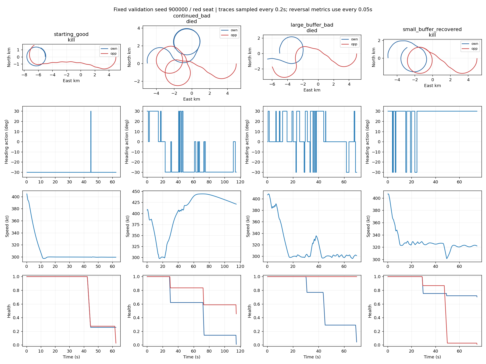
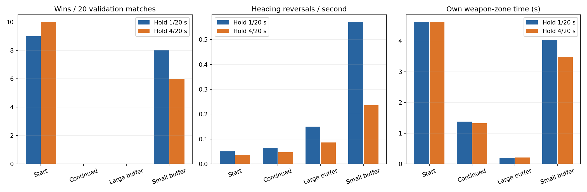

# 비행 실패 진단과 다음 변경 — 2026-10-05

동일 검증 초기조건 10개 × 양 좌석, 모델 4개 × 행동 유지 2조건으로 총 160경기를 비교했다.
추가로 고정 선회 및 속도/선회 채널 교환 4조건 × 20경기를 수행했다.
새 시험 집합을 튜닝에 사용하지 않았으며 모든 결과는 기존 검증 band900000이다.

| 모델 | 원래 20Hz 승리 | 0.2초 유지 승리 | 원래 사격 가능 시간 평균 | 최장 연속 조준 시간 평균 |
|---|---:|---:|---:|---:|
| 시작 좋은 모델 | 9/20 | 10/20 | 4.62초 | 2.86초 |
| 추가 학습 후 실패 | 0/20 | 0/20 | 1.37초 | 0.90초 |
| 50만 버퍼 실패 | 0/20 | 0/20 | 0.20초 | 0.20초 |
| 5만 버퍼 마지막 모델 | 8/20 | 6/20 | 4.03초 | 2.39초 |

행동 유지로 실패 모델이 회복되지 않았고, 성공 모델 하나는 오히려 악화됐다.
따라서 고주파 명령 변경만을 주원인으로 보고 행동 주기를 바꾸지 않는다.
실패 모델은 사격 가능한 기하와 조준 유지 시간을 잃었다. 이것은 실패 양상의 관찰이며
optimizer·관측·탐험 중 어느 것이 궁극 원인인지 확정하는 증거는 아니다.

채널 교환 결과: 실패 선회+좋은 속도 4/20, 좋은 선회+실패 속도 0/20.
속도 정책이 성공에 영향을 주지만, 실패 선회에 좋은 속도를 붙여도 9승까지 복구되지 않아
속도 하나가 유일한 원인이라고 해석하지 않는다. 두 채널은 비행 궤적을 통해 상호작용한다.

좋은 모델의 전체 32,574개 명령 중 31,787개(약97.6%)가 좌선회·감속이었다.
고정 좌선회·감속 정책은 8/20, 고정 우선회·감속 정책은 0/20이었다.
기존 9/20승이 정교한 상황 판단을 배웠다는 충분한 증거는 아니다.
이후 모든 비교에 비학습 고정 좌선회 기준을 포함한다.

다음 변경은 정책의 속도 출력을 감속으로 제한하고 선회 3행동만 학습하는 것이다.
환경 물리나 실제 속도를 강제로 바꾸지 않는다. 기존 9행동 중 {0,3,6}만 사용한다.
3시드 × 1,024,000스텝 새 학습 후 기존 Double DQN·고정 선회와 새 시험에서 비교한다.
이 변경은 가설 검증이며 최적 전투 교리나 일반적 저속 선회 우위 주장으로 해석하지 않는다.

자료: `runs/plan_a_20261005/flight_diagnostics_v2/`, `component_diagnostics/`.
첫 진단 실행은 info에 없는 집계 키를 읽어 실패했다. 수정 후 v2에서 전 경기를 새로 수행했다.

