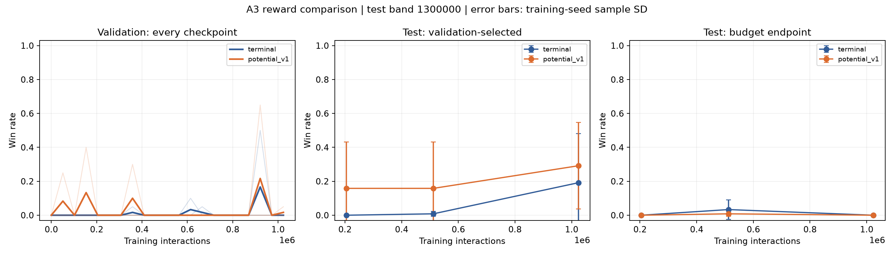

# A3 보상 비교 결과 — 2026-10-01

**고정 potential shaping의 일관된 개선은 확인하지 못했다.** 검증 선택 모델의 평균 시험 승률은
19.17% → 29.17%였지만 seed별 변화는 -12.5 / +42.5 / 0%p였다.
3개 중 1개 seed만 개선했고 마지막 모델은 두 조건 모두 0/40승이다.
사전 조건인 최소 2개 seed 개선을 충족하지 않아 A4 확인 학습은 실행하지 않았다.
대신 검증 이력·최종 replay·Q값의 후속 진단을 완료했다.

## 실행 조건

FairFight red 좌석 학습, 31개 관측, DQN 64·64, 9개 행동, gamma 0.999.
두 보상 × seed 0·1·2 × 1,024,000스텝 = **6,144,000스텝**.
CPU 1스레드 × 3개 프로세스로 학습·검증·시험까지 약 **33.4분** 걸렸다.
환경 설치·구현 시간은 제외한다. 도중에 전이 점검과 짧은 CPU 벤치마크를 병행했다.
이전 PC와 학습 경로가 달라 대조군도 같은 새 PC에서 새로 학습했다.
학습·검증 선택 후 새 시험 band 1300000, 각 모델 40경기(같은 20개 seed를 양 좌석에 사용)로 평가했다.
보상 외 조건은 고정했고, 이전 learner/replay를 재사용하지 않았다.
[사전 프로토콜](shaping.md)과 [선택 고정 기록](../../runs/plan_a_20261001/shaping/selection.json)을 보존했다.

## 검증으로 고른 모델

| 예산 | 보상 | seed 0 · 1 · 2 시험 승리 | 평균 승률 | 시드 간 표본 표준편차 |
|---:|---|---|---:|---:|
| 204,800 | 종료 보상 | 0/40 · 0/40 · 0/40 | 0.00% | 0.00%p |
| 204,800 | potential shaping | 0/40 · 19/40 · 0/40 | 15.83% | 27.42%p |
| 512,000 | 종료 보상 | 1/40 · 0/40 · 0/40 | 0.83% | 1.44%p |
| 512,000 | potential shaping | 0/40 · 19/40 · 0/40 | 15.83% | 27.42%p |
| 1,024,000 | 종료 보상 | 21/40 · 2/40 · 0/40 | 19.17% | 28.98%p |
| 1,024,000 | potential shaping | 16/40 · 19/40 · 0/40 | 29.17% | 25.54%p |

표준편차는 3개 독립 학습 seed 사이의 편차다. 평가 경기 수를 학습 반복 수로 세지 않는다.
같은 시드의 여러 예산은 한 학습 경로를 공유한다.

## 각 예산 마지막 모델

| 예산 | 종료 보상 seed 0 · 1 · 2 | shaping seed 0 · 1 · 2 |
|---:|---|---|
| 204,800 | 0/40 · 0/40 · 0/40 | 0/40 · 0/40 · 0/40 |
| 512,000 | 0/40 · 0/40 · 4/40 | 0/40 · 1/40 · 0/40 |
| 1,024,000 | 0/40 · 0/40 · 0/40 | 0/40 · 0/40 · 0/40 |

## 시험 전에 고정한 대표 후보

- potential_v1, seed 0, 921,600스텝.
- 검증 13/20, 새 시험 16/40 = 40%.
- 시험 성적이 더 높은 다른 seed나 대조군으로 대표 후보를 다시 고르지 않았다.
- 이 후보 보존은 shaping 방법의 최종 채택이나 안정적 수렴을 뜻하지 않는다.
- 경로: [selected_policy](../../runs/plan_a_20261001/shaping/selected_policy/policy.py).

## 후속 진단: 가치 추정의 불안정성

최종 replay에서 고정 seed 1729로 최대 2048개 상태를 표본 추출했다.
보상 정의상 가능한 할인 누적 보상은 종료 보상에서 [-0.2, 1],
shaping에서 [-0.7, 1.5] 이내다. 상태별 더 좁은 범위는 [-0.2-Phi(s), 1-Phi(s)]이다.
실제 terminal에서 Phi=0이므로 할인 shaping 합이 -Phi(initial)로 상쇄되는 성질을 사용했다.

| 보상 | seed | 학습 승리/경기 | 승리한 검증 체크포인트/20 | 최종 표본 Q 최대 | 상태별 가능 범위 밖 Q 비율 |
|---|---:|---:|---:|---:|---:|
| 종료 보상 | 0 | 2/688 | 2/20 | 11.45 | 99.2% |
| 종료 보상 | 1 | 2/693 | 1/20 | 13.65 | 99.0% |
| 종료 보상 | 2 | 3/726 | 1/20 | 20.80 | 99.7% |
| potential shaping | 0 | 7/634 | 2/20 | 86.43 | 100.0% |
| potential shaping | 1 | 1/740 | 3/20 | 16.96 | 98.7% |
| potential shaping | 2 | 0/785 | 0/20 | 30.50 | 93.3% |

마지막 replay의 비영 보상 비율은 종료 보상 약 0.06~0.07%, shaping 100%였지만
성능 유지는 개선되지 않았다. 단순 보상 희소성만으로 현상을 설명하기 어렵다.
6개 버퍼 모두 외부 timeout 마스크는 0이었다. 실제 경기 timeout을 terminal로 처리하는 테스트도 통과했다.
마지막 정책의 최다 행동 비율은 34~54%여서 한 행동만 반복한다고 단정할 수 없다.
Q 예측은 가능한 누적 보상 범위를 크게 벗어났다. 이는 가치 추정 오차의 증거지만,
그 오차가 성능 저하의 유일한 원인이라는 인과 결론은 아니다.
작은 내부 TD 오차도 실제 가치의 정확성을 보장하지 않는다.
[진단 원본](../../runs/plan_a_20261001/shaping/diagnostics.json)을 보존했다.

## 자동 후속 판단과 다음 우선순위

사전 A4 기준은 평균 +10%p, 적어도 2/3 seed 개선, 마지막 모델 평균 비악화였다.
이번 결과는 개선 seed 수 조건을 충족하지 못했다. A4는 미실행이며 band 1400000도 미사용이다.
추가 장시간 학습보다 **가치 학습의 안정성**을 다음 비교의 우선순위로 정했다.
후속 실험은 관측·보상·탐험을 고정하고 학습률 같은 한 요소만 바꾸며,
검증 승리 유지와 Q 범위 이탈을 함께 추적하는 방식이 적절하다.
이번 시험으로 계수를 다시 튜닝하거나 시험 점수로 모델을 재선택하지 않았다.
후속 안정성 비교의 설정과 예산은 아직 확정·실행하지 않았다.

## CPU / CUDA와 검증

- 실제 본 실험은 torch 2.14.1+cpu다. CUDA 학습을 했다고 해석하면 안 된다.
- RTX 5080용 별도 2.14.1+cu130 설치는 완료했지만 Windows 코드 무결성 정책이 DLL을 차단했다.
- WinError 4551, 이벤트 3077/3033. CUDA import와 GPU 벤치마크는 성공하지 못했다.
- 공식 wheel 인덱스: [PyTorch CUDA 13.0](https://download.pytorch.org/whl/cu130/torch/).
- 전체 테스트 80개 통과, 원본 361개 실험 파일 해시 확인, 원본 대표 모델 10/40 재현, 128스텝 재개 확인.
- [새 PC 검증 기록](../../../docs/verification/new_pc_a3.json).
- [전체 요약](../../runs/plan_a_20261001/shaping/summary.json), [전체 시험](../../runs/plan_a_20261001/shaping/test_summary.json).
- 코드와 결과 JSON·그래프·로그·소스 복사본·120개 검증 가중치·대표/최종 모델을 GitHub 보관 대상으로 포함했다.
- [GitHub 보관 목록](../../../docs/verification/a3_github_manifest.json): 318개 파일.
  재생 버퍼 18개(약 230 MiB)는 로컬에 보존하며 A3 학습 재개 시 별도 복사가 필요하다.
- 사용자 결정으로 CUDA 사용과 DLL 해결은 보류했다. Windows 보안 설정을 유지하고 CPU 환경을 사용한다.
