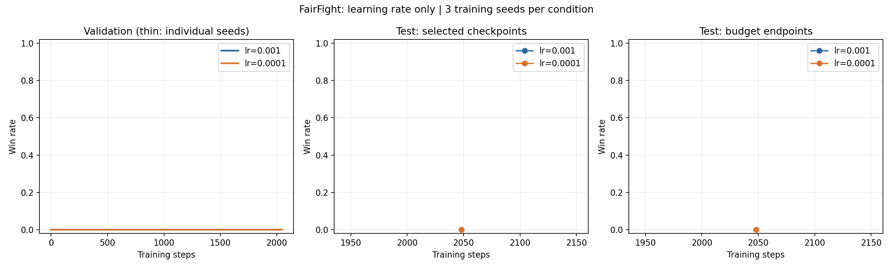
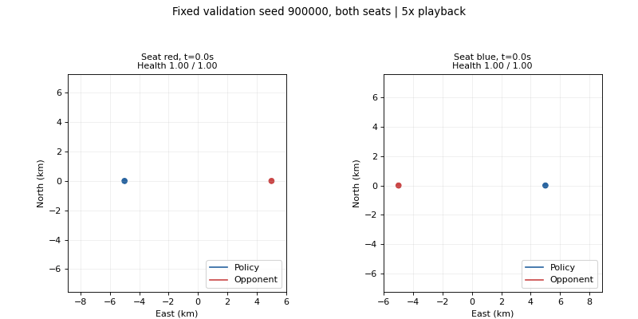

# 학습률 비교 결과 — 2026-10-05

기존 종료 보상·31개 관측·DQN을 유지하고 학습률만 비교했다.
각 조건 3개 학습 시드 × 1,024,000스텝. 같은 노트북 CPU에서 새로 학습했다.

| 학습률 | 모델 선택 | 시드별 승리 / 각 40경기 | 평균 승률 |
|---|---|---|---:|
| 0.001 | 검증 최고 | [0] | 0.00% |
| 0.001 | 마지막 모델 | [0] | 0.00% |
| 0.0001 | 검증 최고 | [0] | 0.00% |
| 0.0001 | 마지막 모델 | [0] | 0.00% |

## 추가 학습 판단

낮은 학습률 조건은 사전 검증 기준을 충족하지 못했다. 같은 설정의 자동 연장은 하지 않는다.
시험 점수로 모델이나 설정을 다시 선택하지 않았다. 3개 학습 시드는 초기 비교이며 확정적 우열을 뜻하지 않는다.

## 보존된 대표 모델

검증으로 사전 선택: lr_1e3, seed 0, 1024스텝.
별도 시험: 0/2승.
대표 모델: selected_policy/policy_net.zip. 마지막 모델과 구분한다.

리플레이는 승리 경기를 골라낸 것이 아니라 고정된 기존 검증 seed 900000의 양 좌석이다.
Q값 진단과 중간 예산 결과는 results.md 및 summary.json에 있다.
