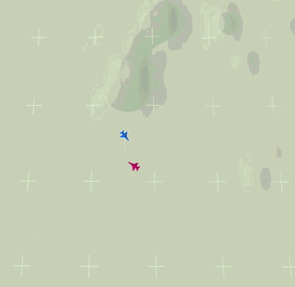

# Project 02 - Evader

Shoot down a target that manoeuvres to break your aim.  You design what the
policy sees and what it is paid; the algorithm comes from `stable-baselines3`.



## What you hand in

The folder [`baseline/`](baseline/), whole:

```
baseline/
├── policy.py         defines `Policy`.  The only thing the marker calls
├── wrappers.py       defines `State` and `RewardFunction`
└── policy_net.zip    weights, written by training
```

**Work inside that folder.**  `train.py` is given.

## The TODOs

| where | what |
|---|---|
| `policy.py` · TODO 1 | algorithm, network, hyperparameters |
| `wrappers.py` · TODO 2 | `State` -- what the policy sees.  The raw channels are the material; Do not just pick |
| `wrappers.py` · TODO 3 | `RewardFunction` -- what one step pays |
| `wrappers.py` · `ACTION_MODE` | `discrete`, 9 preset manoeuvres, or `continuous`, a `Box(-1, 1, (2,))` of heading and speed |

## Training

```bash
python train.py --seed 0
python train.py --seed 0 --steps 300000
```

Writes to `results/baseline/s0/`:

```
policy_net.zip     best on `val`, not the last step
result.json        settings and the best `val` score
```

Training scores itself on the `val` seeds every `VAL_EVERY_STEPS` and keeps
the best snapshot.  

**Copy the one you want into `baseline/` by hand** --
that is what gets marked.

## Scoring your own work

From the repository root:

```bash
python -m tools.grade templates/project_02_evader
python -m tools.watch templates/project_02_evader                  # on screen
python -m tools.watch templates/project_02_evader --tacview        # live TacView (Windows)
```

`grade` writes `score.json` next to the weights.  The kill rate says how well;
the rest says why:

| | |
|---|---|
| `engaged` | share of engagements you aimed at all in |
| `first_wez` | how long it took to get the first aim |
| `longest_track` | longest unbroken track.  Below `TRACK_LOCK_S`, damage is 0 |
| `wez_time` | total time you could shoot |

